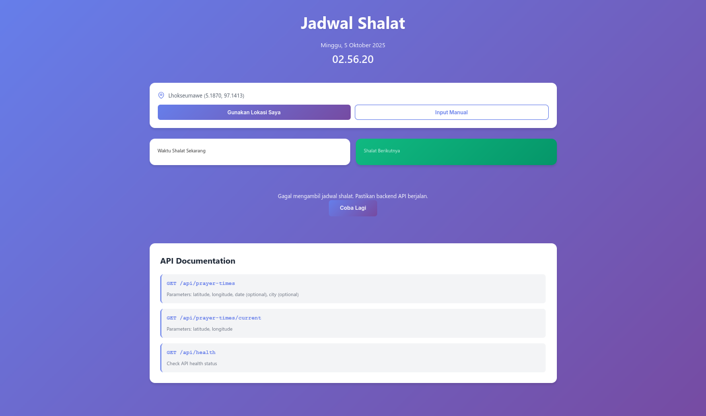

# Aplikasi Jadwal Shalat Indonesia

Aplikasi jadwal shalat dengan backend API Golang dan frontend React, mendukung pencarian lokasi otomatis/manual, serta data kota Indonesia statis tanpa API eksternal.

## 🏗️ Arsitektur

- **Frontend**: React + TypeScript + Vite
- **Backend**: Golang REST API
- **Database**: MySQL (bisa pakai Supabase, PlanetScale, atau MySQL lain)
- **Deployment**: Backend dapat di-deploy ke mana saja (VPS, Cloud Run, Heroku, dll)

## 📋 Fitur

- Menampilkan jadwal shalat berdasarkan lokasi (auto/manual)
- Deteksi lokasi otomatis (GPS/geolocation)
- Input lokasi manual (nama kota/kata kunci)
- Referensi kota Indonesia statis, tanpa API eksternal
- Menampilkan waktu shalat saat ini dan berikutnya
- Countdown ke waktu shalat berikutnya
- API publik, bisa dibagikan
- Caching data di database untuk performa optimal
- Responsive design

## Screenshoot


## 🚀 Cara Menjalankan


### 1. Setup Database

Siapkan database MySQL. Buat tabel sesuai schema di bawah.

go run main.go

### 2. Setup Backend (Golang)

```bash
cd backend
go mod download

# Setup environment variables
export DATABASE_URL="user:password@tcp(host:port)/database"

# Jalankan server
go run main.go
```


Server akan berjalan di `http://localhost:8080`


### 3. Setup Frontend

```bash
cd ../project
npm install
npm run dev
```

Frontend akan berjalan di `http://localhost:5173`

## 📡 API Documentation

### Base URL
```
http://localhost:8080/api
```


### Endpoints

#### 1. Get Prayer Times
Mendapatkan jadwal shalat untuk lokasi/kota dan tanggal tertentu.

```http
GET /api/prayer-times?city={city}&date={date}
```

**Query Parameters:**
- `city` (optional): Nama kota/kata kunci (misal: "Bandung")
- `date` (optional): Tanggal (YYYY-MM-DD, default: hari ini)

**Response:**
```json
{
  "date": "2025-10-05",
  "fajr": "04:30",
  "sunrise": "05:45",
  "dhuhr": "12:00",
  "asr": "15:15",
  "maghrib": "18:00",
  "isha": "19:15",
  "latitude": -6.9175,
  "longitude": 107.6191,
  "city": "Bandung"
}
```

**Contoh Request:**
```bash
curl "http://localhost:8080/api/prayer-times?latitude=-6.2088&longitude=106.8456&city=Jakarta"
```


#### 2. Get Current Prayer Info
Mendapatkan waktu shalat saat ini dan berikutnya.

```http
GET /api/prayer-times/current?latitude={lat}&longitude={lon}
```

**Contoh Request:**
```bash
curl "http://localhost:8080/api/prayer-times/current?latitude=-6.2088&longitude=106.8456"
```

#### 3. Health Check
Mengecek status kesehatan API.

```http
GET /api/health
```

**Response:**
```json
{
  "status": "healthy",
  "time": "2024-10-04T10:30:00Z"
}
```

## 🌐 Deploy Backend ke Production

### Option 1: Deploy ke VPS

1. Copy file backend ke VPS Anda
2. Install Go di VPS
3. Build aplikasi:
```bash
go build -o prayer-times-api main.go
```
4. Setup systemd service atau gunakan process manager seperti PM2
5. Jalankan aplikasi:
```bash
./prayer-times-api
```

docker build -t prayer-times-api .
docker run -p 8080:8080 \

### Option 2: Deploy menggunakan Docker

```bash
cd backend
docker build -t prayer-times-api .
docker run -p 8080:8080 -e DATABASE_URL="your_database_url" prayer-times-api
```

### Option 3: Deploy ke Cloud Run (Google Cloud)

```bash
cd backend

# Build dan push ke Google Container Registry
gcloud builds submit --tag gcr.io/YOUR_PROJECT_ID/prayer-times-api

# Deploy ke Cloud Run
gcloud run deploy prayer-times-api \
  --image gcr.io/YOUR_PROJECT_ID/prayer-times-api \
  --platform managed \
  --region asia-southeast2 \
  --allow-unauthenticated \
  --set-env-vars DATABASE_URL="your_database_url"
```

### Option 4: Deploy ke Heroku

```bash
cd backend

# Login ke Heroku
heroku login

# Create app
heroku create your-app-name

# Set buildpack
heroku buildpacks:set heroku/go

# Set environment variables
heroku config:set DATABASE_URL="your_database_url"

# Deploy
git init
git add .
git commit -m "Initial commit"
git push heroku main
```

## 🔧 Environment Variables


### Backend (.env)
```env
DATABASE_URL=user:password@tcp(host:port)/database
PORT=8080
```

### Frontend (.env)
```env
VITE_SUPABASE_URL=your_supabase_url
VITE_SUPABASE_ANON_KEY=your_supabase_anon_key
VITE_API_URL=http://localhost:8080
```

## 📱 Membagikan API ke Orang Lain

Setelah backend di-deploy, Anda bisa membagikan API endpoint kepada orang lain:

1. Berikan base URL API (contoh: `https://your-api.com`)
2. Share dokumentasi endpoint di atas
3. Pastikan CORS sudah diaktifkan (sudah ter-konfigurasi di kode)

Contoh penggunaan untuk developer lain:

```javascript
// JavaScript/TypeScript
const response = await fetch('https://your-api.com/api/prayer-times?latitude=-6.2088&longitude=106.8456');
const data = await response.json();
console.log(data);
```

```python
# Python
import requests

response = requests.get('https://your-api.com/api/prayer-times', params={
    'latitude': -6.2088,
    'longitude': 106.8456
})
data = response.json()
print(data)
```

```php
// PHP
$url = 'https://your-api.com/api/prayer-times?latitude=-6.2088&longitude=106.8456';
$response = file_get_contents($url);
$data = json_decode($response, true);
print_r($data);
```


## 🗄️ Database Schema

Tabel `prayer_times_cache` untuk caching:
```sql
CREATE TABLE prayer_times_cache (
  id INT AUTO_INCREMENT PRIMARY KEY,
  date DATE NOT NULL,
  fajr VARCHAR(10) NOT NULL,
  sunrise VARCHAR(10) NOT NULL,
  dhuhr VARCHAR(10) NOT NULL,
  asr VARCHAR(10) NOT NULL,
  maghrib VARCHAR(10) NOT NULL,
  isha VARCHAR(10) NOT NULL,
  latitude DECIMAL(10,6) NOT NULL,
  longitude DECIMAL(10,6) NOT NULL,
  created_at TIMESTAMP DEFAULT CURRENT_TIMESTAMP,
  UNIQUE(date, latitude, longitude)
);
```

## 📝 Catatan

- Perhitungan waktu shalat menggunakan metode standar (bisa integrasi library go-prayer)
- Data kota Indonesia statis, tidak perlu API eksternal
- Data di-cache selama 7 hari untuk performa
- API sudah menggunakan CORS
- Backend publik, tidak perlu authentication

## 🤝 Kontribusi

Silakan fork dan buat pull request untuk kontribusi!

## 📄 License

MIT License
